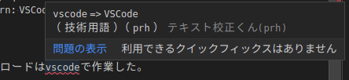
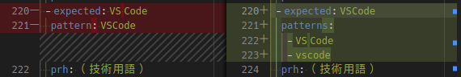
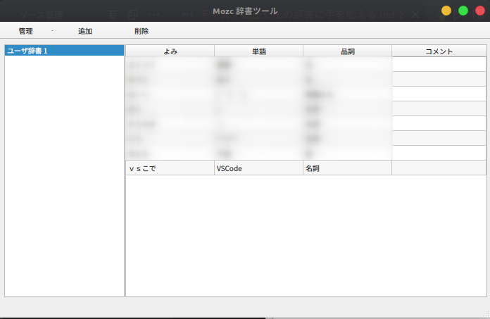

<!--  
- 最終更新日
- 
  -->

# 辞書の場所
`~/.vscode/extensions/ics.japanese-proofreading-1.1.0/node_modules/textlint-rule-preset-icsmedia/dict`
# 辞書ファイルの場所
```log
 terms  terms-Desks  ../dict  grep -ie vscode *
prh_web_technology.yml:    pattern: VSCode
```
# gitへ登録しておく
`git init`
後のコミットやGithubへのアップロードはvscodeで作業した。

# 変更
`prh_web_technology.yml`ファイルについて以下のように変更した。


# Mozcへ登録
`ｖｓこで`と入力した時に`VSCode`と変換されるようにしておく。
